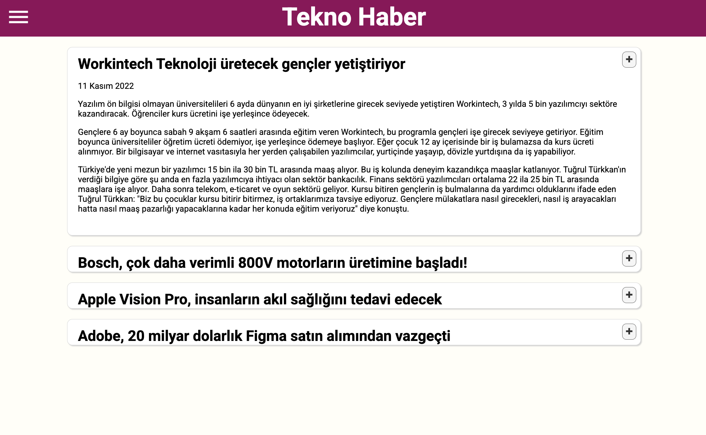

# JS DOM — Dinamik Bileşenler Projesi

Bu proje, **DOM Manipülasyonu** ödevi kapsamında hazırlanmıştır. Amacı, JavaScript kullanarak HTML elemanlarını dinamik bir şekilde oluşturmayı, düzenlemeyi ve sayfaya eklemeyi göstermektir.

---

## 📂 Proje Klasör Yapısı

```
root/
├─ index.html           # Ana HTML dosyası
├─ index.css            # Genel stil dosyası
├─ Image/
│  ├─ Index.png
├─ components/
│  ├─ card/
│  │  ├─ card.js
│  │  └─ card.css
│  ├─ iconButton/
│  │  ├─ iconButton.js
│  │  └─ iconButton.css
│  ├─ menu/
│  │  ├─ menu.js
│  │  └─ menu.css
│  └─ haber/
│     ├─ haberler.js
│     └─ haberler.css
└─ package.json
```

---

## 📝 Açıklama

Projedeki tüm bileşenler **JavaScript (vanilla JS)** ile yazılmıştır. Bileşenler `document.createElement`, `appendChild`, `classList.add`, `setAttribute` gibi **temel DOM yöntemleri** kullanılarak oluşturulmuştur.

Bu ödevde amaç;

* HTML etiketlerini **JavaScript ile dinamik üretmek**,
* Parametreli fonksiyonlarla **yeniden kullanılabilir bileşenler** yapmak,
* CSS ile her bileşeni bağımsız bir şekilde stillendirmek,
* DOM API’sini kullanarak **veri tabanlı içerikler** oluşturmayı öğrenmektir.

---

## 🧩 Bileşenler ve Örnek Kullanım

### 1. Card

**Amaç:** Görsel, başlık, açıklama ve yönlendirme linkinden oluşur.

**Fonksiyon:**

```js
card(imgURL, header, paragraph, navigationURL)
```

**Örnek Kullanım:**

```html
<div id="container"></div>
<script src="./components/card/card.js"></script>
<script>
  const container = document.getElementById('container');
  const c = card(
    'https://picsum.photos/400/200',
    'DOM Ödevi',
    'Bu kart JavaScript ile oluşturuldu.',
    'https://ornek.com'
  );
  container.appendChild(c);
</script>
```

---

### 2. IconButton

**Amaç:** İkon ve renge sahip buton oluşturur.

**Fonksiyon:**

```js
IconButton(btnText, btnColor, iconClass)
```

**Örnek Kullanım:**

```html
<div id="btns"></div>
<script src="./components/iconButton/iconButton.js"></script>
<script>
  const btns = document.getElementById('btns');
  btns.append(
    IconButton('Kaydet', 'blue', 'fa fa-save'),
    IconButton('Sil', 'red', 'fa fa-trash')
  );
</script>
```

---

### 3. Menü

**Amaç:** Kategorilerden oluşan bir liste menüsü oluşturur.

**Fonksiyon:**

```js
MenuYapici(kategoriler)
```

**Örnek Kullanım:**

```html
<div id="menu"></div>
<script src="./components/menu/menu.js"></script>
<script>
  const menu = MenuYapici(['Teknoloji', 'Spor', 'Kültür']);
  document.getElementById('menu').appendChild(menu);
</script>
```

---

### 4. Haber

**Amaç:** Başlık, tarih ve paragraflardan oluşan haber kartları oluşturur.

**Fonksiyon:**

```js
HaberYapici(baslik, tarih, p1, p2, p3)
```

**Örnek Kullanım:**

```html
<div class="articles"></div>
<script src="./components/haber/haberler.js"></script>
<script>
  const article = HaberYapici(
    'JavaScript ile DOM Manipülasyonu',
    '18.09.2025',
    'İlk paragraf örneği...',
    'İkinci paragraf örneği...',
    'Üçüncü paragraf örneği...'
  );
  document.querySelector('.articles').appendChild(article);
</script>
```

---

## 📸 Ekran Görüntüsü

Aşağıda proje çıktısına ait örnek bir ekran görüntüsü bulunmaktadır:




---

## 🎯 Öğrenilen Konular

* DOM üzerinde eleman oluşturma (`createElement`)
* Elemanlara özellik ekleme (`setAttribute`, `classList.add`)
* İç içe yapılar kurma (`appendChild`, `append`)
* Dinamik veriyle içerik üretme
* Fonksiyonel ve tekrar kullanılabilir bileşen geliştirme

---

## 📌 Sonuç

Bu proje sayesinde **DOM manipülasyonunun temel prensipleri** öğrenilmiş ve farklı senaryolara uygulanabilecek **dinamik bileşenler** geliştirilmiştir.
